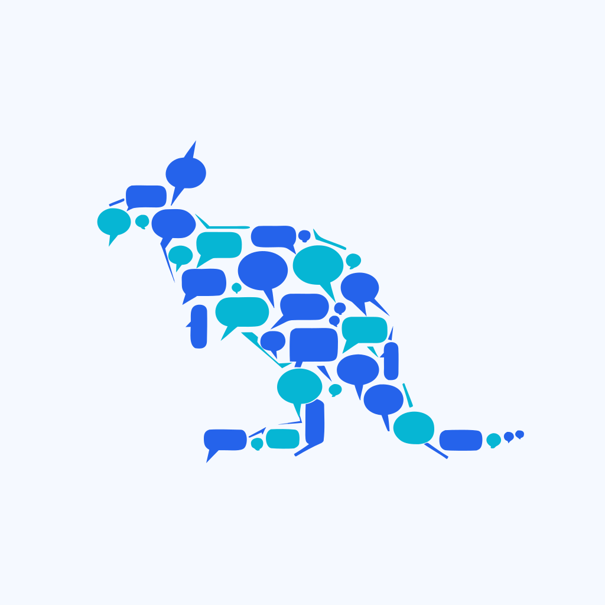
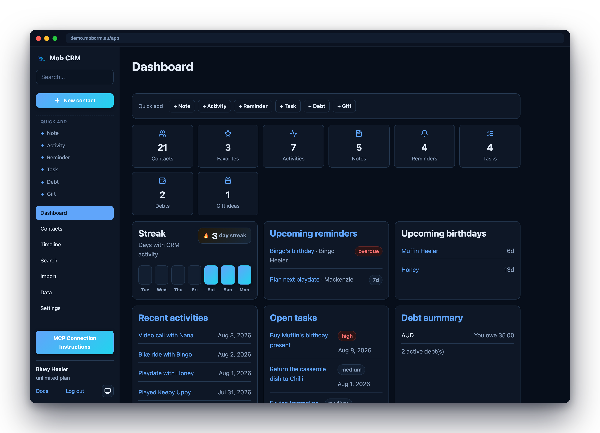
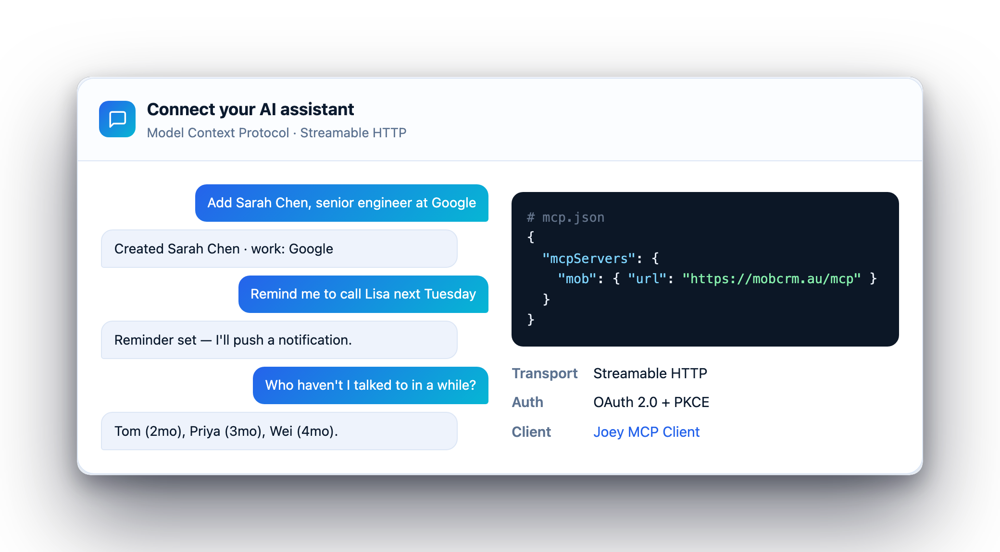

#  Mob

**Mob is an AI-first personal CRM for caring for the people in your life.** Tell your AI assistant what happened, who matters, and what you want to remember; Mob turns natural language into structured relationship memory through MCP.

<p>
  <a href="https://demo.mobcrm.au/app/"><strong>Try the live demo</strong></a> ·
  <a href="https://mobcrm.au/auth/register?from=web"><strong>Sign up free while in beta</strong></a>
</p>

<p align="center">
  
</p>

## Why Mob

Relationships are full of details: birthdays, family ties, dietary needs, last conversations, gift ideas, follow-ups, and the context that helps you show up well. Mob keeps those details organized without making you maintain another spreadsheet or click through a dashboard.

Use it naturally:

```text
Add Sarah Chen. She works at Google and I met her at Lina's birthday dinner.
Log coffee with Mike yesterday; he is training for a marathon.
Remind me to message Priya before her trip next Friday.
Who have I not caught up with lately?
```

<p align="center">
  
</p>

## What Mob helps with

- Build rich contact profiles from everyday conversation.
- Remember relationships, notes, preferences, birthdays, reminders, gifts, debts, tasks, and shared history.
- See timelines and search across everything you know about your contacts.
- Connect AI assistants over MCP, use the web app when you want to browse, and automate through the public API.

## Get started

Hosted Mob is free during beta with all core features enabled.

- **Live demo:** <https://demo.mobcrm.au/app/>
- **Sign up:** <https://mobcrm.au/auth/register?from=web>
- **Documentation:** <https://mobcrm.au/docs/>

## Self-hosting

Mob is open source and can be self-hosted with Node.js and SQLite. See the **[self-hosting guide](https://mobcrm.au/docs/self-hosting)** for installation, environment variables, persistent storage, email, and deployment notes.

## Open source, license, and support

Mob is available under the [Functional Source License 1.1 (MIT Future License)](LICENSE) — free to use, modify, and self-host for any non-competing purpose, and it converts to the MIT License two years after each release. For hosted beta support, account help, or feedback, email [mobsupport@benkaiser.dev](mailto:mobsupport@benkaiser.dev).
